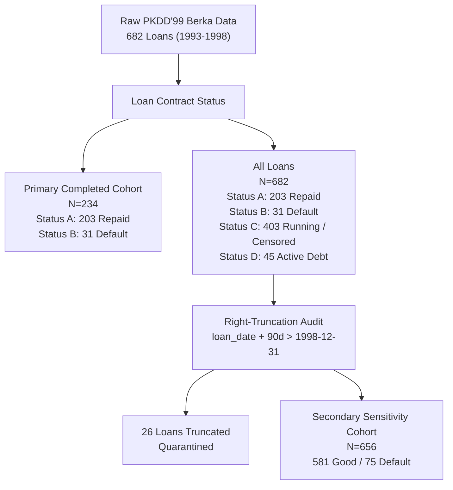

# Early Loan Default Risk Detection from Transaction Behaviour

[](https://www.python.org/downloads/)
[](tests/test_leakage.py)
[](LICENSE)
[](docs/research_paper.md)

An empirical machine learning research project investigating whether early post-disbursement banking transaction dynamics provide incremental predictive information for identifying loan default risk beyond origination scorecards, and how predictive capacity unfolds across 30, 60, and 90-day observation windows.

Developed on the historical **PKDD'99 Czech Bank (Berka) dataset** (682 loans, 1,056,320 transactions spanning 1993–1998).

---

## 1. Project Overview

In commercial banking, credit underwriting scorecards traditionally assess creditworthiness at loan origination using applicant demographic profiles, credit bureau scores, and pre-existing banking tenure. However, once loan proceeds are disbursed, the lender observes high-frequency account transactions—such as payroll deposits, cash withdrawals, standing orders, and daily balance movements.

This project examines **early post-disbursement behavioural surveillance** as an operational bridge between initial credit origination and late-stage collections/workout. Using a leakage-safe temporal pipeline, we evaluate whether transaction dynamics in the first 30 to 90 days after loan disbursement reveal early signs of default risk, and quantify the marginal value of longer observation windows.

---

## 2. Research Question & Hypotheses

> **Using only transaction behaviour observed after loan disbursement, can early behavioural patterns distinguish loans that eventually default from loans that are successfully repaid, and how early does useful predictive information become available?**

### Formal Research Hypotheses
* **Hypothesis 1 (Incremental Predictive Value)**: Dynamic post-disbursement transaction features within early observation windows ($W \in \{30, 60, 90\}$ days) provide incremental predictive power for distinguishing eventual default from successful repayment beyond a baseline of static origination characteristics and pre-loan banking history ($\text{PR-AUC}_{\text{Model B}} > \text{PR-AUC}_{\text{Model A}}$).
* **Hypothesis 2 (Model-Dependent Information Progression)**: Predictive capacity accumulates across time horizons, but the rate of information arrival and plateau timing vary across model families rather than conforming to a single universal optimal window.
* **Hypothesis 3 (Sub-Overdraft Behavioural Signal)**: The incremental predictive lift from behavioural features is not solely an artifact of accounts having already breached an unauthorized overdraft within the window; positive lift persists among borrowers who remain strictly non-negative throughout the observation period.

---

## 3. Dataset

The empirical study is conducted on the historical **PKDD'99 Financial Data (Czech Bank / Berka dataset)**:
* **Scope**: 682 loans originated between January 1993 and December 1998 across 5,369 clients, 4,500 accounts, and 1,056,320 transaction records.
* **Relational Schema**: Relational tables capturing loan terms (`loan.asc`), account registrations (`account.asc`), client demographics (`client.asc`), disposition permissions (`disp.asc`), credit cards (`card.asc`), permanent orders (`order.asc`), demographic district statistics (`district.asc`), and transaction ledgers (`trans.asc`).
* **Study Export Cutoff**: All transaction records terminate on **December 31, 1998**.

---

## 4. Problem Definition: Credit Risk vs. Fraud Detection

This project is explicitly about **loan default risk detection**, NOT fraud detection:
* **Credit Default Risk**: Involves legitimate borrowers whose financial capacity deteriorates over time, resulting in delinquency and eventual failure to meet scheduled amortization obligations.
* **Fraud Detection**: Involves identity deception, synthetic identities, or immediate planned bust-out without intent to repay. The Berka dataset contains genuine commercial loans without defensible fraud labels.
* **Methodological Relevance to Fraud Modeling**: While the problem is credit default, the technical methodology directly transfers to fraud analytics:
  * High-frequency transaction feature engineering
  * Temporal boundary enforcement and leak prevention
  * Severe class imbalance modeling ($13.25\%$ base rate)
  * Paired evaluation under rare-event sample constraints

---

## 5. Methodology & Portfolio Context

This study forms part of an applied machine learning portfolio spanning industrial telemetry (SCANIA condition monitoring), observational pharmacovigilance (FAERS drug safety), and power grid load forecasting (Nordic SE3):

> ### Methodological Throughline: Deconfounding Apparent Signals
> Across both the FAERS drug safety and financial credit risk projects, a central methodological theme is **distinguishing a genuine predictive or safety signal from an apparent signal driven by a plausible confound, shortcut, or reporting artefact**.
>
> In **FAERS pharmacovigilance**, widespread prescription of common drugs can create an apparent toxicity signal that reflects background reporting frequency rather than true pharmacology; negative-control drug-event pairs are utilized to verify that background noise does not generate false alarms.
>
> In this **credit risk project**, an apparent behavioural signal could easily be trivialized if the model simply flags accounts that have already crossed into an unauthorized negative balance. We address this by conducting a **solvent-subcohort analysis**, evaluating whether the behavioural model retains predictive lift among borrowers whose balances remain strictly non-negative throughout the observation window.
>
> While the specific techniques differ (disproportionality negative controls vs. subcohort stratification), both challenge whether an observed predictive association is merely explained by an obvious alternative mechanism.

---

## 6. Cohort Architecture & Censoring Strategy



### 6.1 Primary Completed Cohort ($N=234$) — Headline Ground Truth
* **Composition**: Completed loans only (`Status A` repaid = 203, `Status B` default = 31).
* **Default Base Rate**: **$13.25\%$** (31 / 234).
* **Ground-Truth Certainty**: The completed cohort is prioritized as the primary headline dataset because every contract reached maturity before the study export cutoff. The final outcome is observed with certainty without right-censoring.
* **Right-Truncation Status**: The latest completed loan was originated in December 1997. Across all windows ($W \in \{30, 60, 90\}$ days), exactly **0 loans are right-truncated**.

### 6.2 Secondary Sensitivity Cohort ($N=656$) — Robustness Analysis
* **Composition**: Completed loans plus running contracts (`Status C` running/unproblematic = 403, `Status D` running in debt = 45).
* **Right-Truncation Handling**: Loans disbursed after October 2, 1998 lack a full 90-day window before December 31, 1998. Exactly **26 loans are right-truncated**. These 26 loans are explicitly quarantined rather than imputed with zero activity, leaving $N=656$ loans (581 good, 75 default; $11.43\%$ base rate).
* **Role**: Because `Status C` contracts were active at export, their eventual repayment status is right-censored. The expanded cohort serves strictly as a **secondary sensitivity analysis** to test whether findings transfer beyond completed contracts, not as an alternative ground truth.

---

## 7. Leakage Prevention & Audit of Data Shortcuts

To maintain strict empirical validity, we implemented four architectural controls:

1. **Strict Temporal Demarcation:**
   - Post-disbursement features are restricted strictly to $T_{\text{loan}} \le \text{trans\_date} \le T_{\text{loan}} + W$.

   - **Day 0 Rule:** Transactions on the origination date (`trans_date == loan_date`) are included, as loan disbursement credits and initial drawdowns occur on Day 0.

   - **Pre-Loan Isolation:** Transactions prior to disbursement (`trans_date < loan_date`) are forbidden from windowed behavioral aggregations. They enter the model exclusively through two static pre-loan control features (`feat_had_pre_loan_overdraft`, `feat_pre_loan_tx_count`).

2. **Auditing Target Leakage & Censoring Shortcuts:**
   - *Full-Lifetime Balance Leakage:* Full-lifetime minimum balance perfectly separates the observed good and bad loan-status labels in this dataset (100% separation), making it a target-leakage shortcut for early prediction rather than a prospective risk signal.
   - *Duration Shortcut:* Loan duration was identified as a calendar-censoring shortcut when separating completed from running contracts across the full dataset (99.4% separation due to the 1998 cutoff), but it does not provide the same predictive shortcut for default within the completed A/B cohort. `duration` is explicitly retained as one of the 11 static Model A origination features, but is recognized as non-predictive of default in the completed cohort.

3. **Strict Preprocessing Isolation:** All continuous feature scalers (`StandardScaler`) and imputation parameters are fitted strictly inside each cross-validation training fold and applied to out-of-fold validation sets.

4. **Automated Verification:** The pipeline is guarded by 9 automated pytest tests in [`tests/test_leakage.py`](tests/test_leakage.py) verifying zero leakage.

---

## 8. Feature Engineering

The feature extraction pipeline produces 52 deterministic features documented in [`data/processed/data_dictionary.csv`](data/processed/data_dictionary.csv):

* **Static Origination Features (11)**:
  * Contract: `amount`, `duration`, `payments`, `payment_to_amount_ratio`.
  * Borrower & Account: `account_age_days`, `client_age_years`, `client_is_female`.
  * District Macroeconomics: `salary`, `unemployment`, `crimes`, `entrepreneurs`.
* **Pre-Loan History Controls (2)**:
  * `feat_had_pre_loan_overdraft`: Binary indicator of unauthorized negative balance prior to loan date.
  * `feat_pre_loan_tx_count`: Transaction volume prior to loan origination.
* **Post-Disbursement Dynamic Features (13 per window $W \in \{30, 60, 90\}$ days)**:
  * Cash Flows: `trans_count`, `inflow_total`, `outflow_total`, `net_cash_flow`, `outflow_to_inflow_ratio`.
  * Cash Activity: `cash_withdrawal_amount`, `cash_withdrawal_ratio`.
  * Balance Dynamics: `balance_mean`, `balance_min`, `balance_slope` (daily balance linear trend).
  * Stress Indicators: `had_negative_balance`, `had_sanction_interest`, `min_bal_to_payment_ratio`.

---

## 9. Model Design & Ablation Framework

We implement an explicit paired ablation:

* **Model A (Historical / Origination Baseline, 13 features)**:
  * 11 static origination features + 2 pre-loan history controls.
  * Represents all information observable at loan signing.
* **Model B (Dynamic Behavioural Model, 26 features)**:
  * All 13 Model A features + 13 window-specific post-disbursement dynamic features.
  * Represents origination data enriched with ongoing post-disbursement transaction surveillance.

### Evaluated Model Families
1. **Logistic Regression (L2 Regularized)**: Linear benchmark with `StandardScaler` fitted on train folds and inner 5-fold cross-validation tuning $C \in \{0.01, 0.1, 1.0, 10.0\}$ optimizing Average Precision with `class_weight='balanced'`.
2. **Random Forest**: Non-linear ensemble with shallow depth (`max_depth=4`, `min_samples_leaf=5`, `n_estimators=100`, `class_weight='balanced_subsample'`).
3. **HistGradientBoosting**: Non-linear boosting ensemble with constrained complexity (`max_iter=100`, `max_leaf_nodes=15`, `min_samples_leaf=10`, `class_weight='balanced'`).

---

## 10. Evaluation Protocol & Identical Fold Reuse

* **Primary Metric**: **Precision-Recall AUC (PR-AUC / Average Precision)** is prioritized due to severe class imbalance ($13.25\%$ base rate). Secondary metrics: ROC-AUC, Brier score.
* **Locked Cross-Validation Protocol**:
  * 5-fold `StratifiedKFold` $\times$ 5 repeats = **25 evaluation units** generated once on the primary cohort ($N=234$) and locked in [`data/processed/cv_splits_completed_n234.csv`](data/processed/cv_splits_completed_n234.csv).
  * Every test fold contains exactly 46 or 47 loans and 6 or 7 defaults (median: 6.0).
  * **Mandatory Reuse**: The exact same 25 fold assignments are reused across all observation windows (30d, 60d, 90d), both feature spaces (Model A vs. Model B), and all three machine learning algorithms.
* **Paired Difference Analysis**: For every evaluation fold $k \in \{1, \dots, 25\}$, we compute:
  $$\Delta_{\text{PR-AUC}}^{(k)} = \text{PR-AUC}_{\text{Model B}}^{(k)} - \text{PR-AUC}_{\text{Model A}}^{(k)}$$
  Paired win rate is the proportion of splits where $\Delta^{(k)} > 0$.

---

## 11. Results

### 11.1 Primary Ablation: Model A vs. Model B ($N=234$)
All values report the mean $\pm$ standard deviation across the 25 evaluation splits. Paired $\Delta = \text{Score}(\text{Model B}) - \text{Score}(\text{Model A})$.

| Model Family | Window | Model A PR-AUC | Model B PR-AUC | Mean $\Delta$ | Paired Win Rate | Model A ROC-AUC | Model B ROC-AUC | Model A Brier | Model B Brier |
| :--- | :---: | :---: | :---: | :---: | :---: | :---: | :---: | :---: | :---: |
| **Logistic Regression** | **30d** | $0.524 \pm 0.117$ | $0.708 \pm 0.124$ | **+0.184** | **92.0%** (23/25) | $0.755 \pm 0.088$ | $0.863 \pm 0.076$ | $0.179 \pm 0.026$ | $0.135 \pm 0.023$ |
| **Logistic Regression** | **60d** | $0.524 \pm 0.117$ | $0.748 \pm 0.109$ | **+0.224** | **96.0%** (24/25) | $0.755 \pm 0.088$ | $0.886 \pm 0.062$ | $0.179 \pm 0.026$ | $0.109 \pm 0.024$ |
| **Logistic Regression** | **90d** | $0.524 \pm 0.117$ | $0.757 \pm 0.101$ | **+0.233** | **96.0%** (24/25) | $0.755 \pm 0.088$ | $0.886 \pm 0.057$ | $0.179 \pm 0.026$ | $0.112 \pm 0.020$ |
| **HistGradientBoosting** | **30d** | $0.333 \pm 0.116$ | $0.613 \pm 0.165$ | **+0.280** | **96.0%** (24/25) | $0.678 \pm 0.098$ | $0.809 \pm 0.123$ | $0.139 \pm 0.025$ | $0.092 \pm 0.032$ |
| **HistGradientBoosting** | **60d** | $0.333 \pm 0.116$ | $0.631 \pm 0.141$ | **+0.298** | **100.0%** (25/25) | $0.678 \pm 0.098$ | $0.833 \pm 0.106$ | $0.139 \pm 0.025$ | $0.088 \pm 0.026$ |
| **HistGradientBoosting** | **90d** | $0.333 \pm 0.116$ | $0.692 \pm 0.127$ | **+0.359** | **96.0%** (24/25) | $0.678 \pm 0.098$ | $0.872 \pm 0.082$ | $0.139 \pm 0.025$ | $0.080 \pm 0.021$ |
| **Random Forest** | **30d** | $0.351 \pm 0.131$ | $0.602 \pm 0.165$ | **+0.251** | **92.0%** (23/25) | $0.694 \pm 0.111$ | $0.816 \pm 0.095$ | $0.138 \pm 0.014$ | $0.105 \pm 0.011$ |
| **Random Forest** | **60d** | $0.351 \pm 0.131$ | $0.589 \pm 0.150$ | **+0.238** | **92.0%** (23/25) | $0.694 \pm 0.111$ | $0.843 \pm 0.095$ | $0.138 \pm 0.014$ | $0.099 \pm 0.012$ |
| **Random Forest** | **90d** | $0.351 \pm 0.131$ | $0.628 \pm 0.141$ | **+0.278** | **96.0%** (24/25) | $0.694 \pm 0.111$ | $0.861 \pm 0.090$ | $0.138 \pm 0.014$ | $0.093 \pm 0.014$ |

*(Supplementary Wilcoxon signed-rank tests yield $p < 10^{-5}$ across all comparisons; the 25 evaluation splits stem from repeated CV and are not statistically independent).*

### 11.2 Model-Dependent Information Arrival
* **Logistic Regression**: Captures substantial linear predictive signal within 60 days ($+0.040$ from 30d $\to$ 60d, win rate $72.0\%$, $p = 0.039$), but largely plateaus from 60d to 90d ($+0.009$, win rate $44.0\%$, $p = 0.615$).
* **HistGradientBoosting**: Captures gradual gains from 30d to 60d ($+0.018$, win rate $60.0\%$), with significant non-linear interaction gains from 60d to 90d ($+0.061$, win rate $72.0\%$, $p = 0.017$).
* **Random Forest**: Performance is flat from 30d to 60d ($-0.013$, win rate $40.0\%$), followed by gains by 90d ($+0.040$, win rate $64.0\%$, $p = 0.039$).
* **Conclusion**: Substantial behavioural predictive signal is detectable within 60 days for linear and gradient-boosted models, while Random Forest captures additional signal by 90 days, demonstrating that **information arrival is model-dependent**. There is no universal optimal observation window.

---

## 12. Robustness & Sensitivity Analyses

To evaluate model stability under various observational conditions, we conducted three distinct robustness/sensitivity analyses:

### A. Solvent-Subcohort Analysis
Evaluating borrowers whose balances remained strictly non-negative ($\min(\text{balance}) \ge 0$) throughout the observation window:
* **LogReg 60d**: PR-AUC 0.698 vs 0.513 (Mean $\Delta = +0.184$, win rate $92.0\%$).
* **HGB 60d**: PR-AUC 0.602 vs 0.333 (Mean $\Delta = +0.268$, win rate $96.0\%$).
* **RF 60d**: PR-AUC 0.542 vs 0.361 (Mean $\Delta = +0.182$, win rate $80.0\%$).
* **Finding**: Provides evidence that the incremental predictive signal is not solely attributable to borrowers who had already entered negative balance during the observation window.

### B. Chronological Out-of-Time Holdout
* **Trained**: 1993–1995 ($N=156$, 22 defaults) | **Tested**: 1996–1997 ($N=78$, 9 defaults).
* **LogReg 60d**: OOT PR-AUC 0.630 vs 0.345 ($\Delta = +0.286$); ROC-AUC 0.895 vs 0.630; Brier 0.119 vs 0.177.
* **Finding**: Provides **supporting evidence of temporal robustness**. The chronological test set contains only 9 defaults, so OOT point estimates have substantial sampling uncertainty and should be interpreted as supporting evidence rather than definitive prospective performance estimates.

### C. Secondary Sensitivity Analysis ($N=656$) at 90 Days
* **LogReg**: PR-AUC $0.785 \pm 0.092$ vs $0.577 \pm 0.091$ ($\Delta = +0.208$, win rate $100\%$).
* **HGB**: PR-AUC $0.841 \pm 0.069$ vs $0.591 \pm 0.084$ ($\Delta = +0.251$, win rate $100\%$).
* **RF**: PR-AUC $0.756 \pm 0.084$ vs $0.538 \pm 0.104$ ($\Delta = +0.218$, win rate $96.0\%$).
* **Finding**: Provides secondary sensitivity evidence that the incremental behavioural signal is not solely an artifact of selecting completed loans. Status `C` loans remain right-censored.

---

## 13. Methodological Limitations

1. **31 Positive Events in Primary Cohort**: Inherent sampling variance in point estimates.
2. **Historical Single-Institution Context**: Czech commercial bank (1993–1998) during economic transition.
3. **Completed-Loan Cohort Selection**: Matured contracts overrepresent shorter-term loans.
4. **Right-Censoring in Status `C`**: Running contracts in the expanded cohort may have experienced unobserved defaults after December 1998.
5. **Only 9 Defaults in OOT Holdout**: Chronological holdout point metrics carry wide sampling intervals.
6. **Observational & Non-Causal Features**: Features reflect symptoms of distress within a regularized model, not causal intervention levers.
7. **No External Cross-Institutional Validation**: Findings reflect internal validation without external bank testing.

---

## 14. Reproducibility Guide

> **Reproducibility Note**: The analysis is reproducible with the provided artifacts and documented dataset acquisition pipeline. Processed modeling cohorts, feature matrices, and cross-validation partition assignments are tracked in `data/processed/` so that all experiments, paired ablations, and robustness evaluations can be run out of the box without requiring external database downloads. Instructions for rebuilding the feature store from the raw PKDD'99 database are also provided below.

### Prerequisites
* Python 3.10+
* Virtual environment (`venv` or `conda`)

### Installation
```bash
git clone https://github.com/mohana-kamineni/loan-default-risk.git
cd loan-default-risk
python -m venv venv
venv\Scripts\activate      # On Windows
# source venv/bin/activate  # On Linux/macOS
pip install -r requirements.txt
```

### Running Automated Tests
Verify temporal boundaries, target independence, and leakage quarantine:
```bash
pytest tests/ -v
```
All 9 automated unit tests verify that no future or pre-loan transactions leak into windowed features, entity disjointness is enforced, and documented leakage shortcuts are quarantined.

### Rebuilding Feature Datasets (Optional)
If raw data is present in `berka-dataset/`:
```bash
python scripts/build_datasets.py
```
*(Processed modeling datasets and CV split definitions are included in `data/processed/` for out-of-the-box reproducibility without needing raw downloads).*

### Executing Machine Learning Experiments
Execute the full 25-fold cross-validation matrix, paired ablations, OOT split, and sensitivity analyses:
```bash
python scripts/run_experiments.py
```
All out-of-fold predictions, fold metrics, and summary tables will be saved to `experiments/`.

---

## 15. Project Structure

```
loan-default-risk/
│
├── data/
│   └── processed/                # Processed modeling cohorts & locked CV splits
│       ├── cv_splits_completed_n234.csv
│       ├── cv_splits_expanded_n656.csv
│       ├── completed_cohort_w30d.csv
│       ├── completed_cohort_w60d.csv
│       ├── completed_cohort_w90d.csv
│       ├── expanded_cohort_w90d.csv
│       └── data_dictionary.csv
│
├── docs/                         # Research paper, portfolio brief & schema docs
│   ├── research_paper.md         # Full research synthesis paper
│   ├── portfolio_summary.md      # Master's thesis application brief
│   ├── cv_summary.md             # ATS-friendly CV bullets & boundary audit
│   └── dataset_schema.txt        # Relational schema reference
│
├── experiments/                  # Experimental results & summary tables
│   ├── cv_fold_metrics_master.csv
│   ├── predictions_master.csv
│   ├── summary_model_a_b_comparison.csv
│   ├── summary_window_comparisons.csv
│   ├── oot_metrics.csv
│   └── summary_expanded_sensitivity_90d.csv
│
├── scripts/                      # Executable CLI workflows
│   ├── audit/                    # Exploratory data auditing scripts
│   ├── build_datasets.py         # ETL pipeline from raw tables to processed cohorts
│   └── run_experiments.py        # Complete experimental matrix execution
│
├── src/                          # Core modular library
│   ├── ingestion.py              # Schema validation & relational joins
│   ├── cohorts.py                # Cohort filters & right-truncation quarantine
│   ├── features.py               # Leakage-safe temporal feature extraction
│   ├── data_dictionary.py        # 52-feature schema metadata dictionary
│   └── modeling.py               # Reusable CV execution & paired ablation engine
│
├── tests/                        # Automated unit tests
│   └── test_leakage.py           # 9 automated leakage and boundary tests
│
├── .gitignore                    # Git exclusion rules
├── LICENSE                       # MIT License
├── README.md                     # Comprehensive repository documentation
└── requirements.txt              # Python package dependencies
```

---

## 16. References & Dataset Source

* **Dataset**: Berka, P. and Sochorova, I. (1999). *PKDD'99 Discovery Challenge: Financial Data*. Principles of Data Mining and Knowledge Discovery.
* **Domain Context**: Basel Committee on Banking Supervision (BCBS). *International Convergence of Capital Measurement and Capital Standards (Basel II)*. Bank for International Settlements.
* **Code & Documentation**: Released under the [MIT License](LICENSE).
