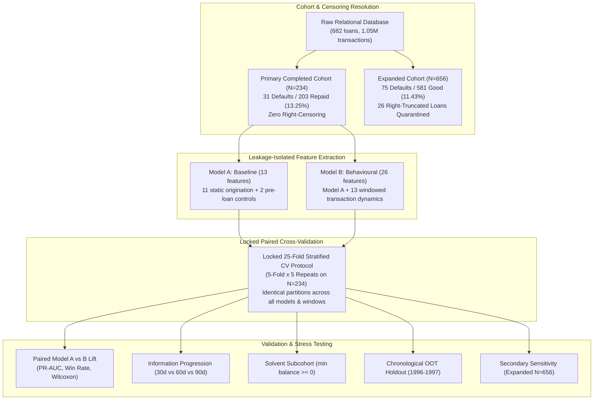

# Portfolio Summary & Thesis Application Brief: Early Loan Default Risk Detection

**Project Title**: Early Loan Default Risk Detection from Transaction Behaviour  
**Focus Area**: Financial Services Analytics, Credit Risk Modeling, Behavioral Surveillance  
**Repository**: `loan-default-risk`  
**Dataset**: PKDD'99 Czech Bank Financial Data (682 loans, 1.05M transactions, 1993–1998)  

---

## 1. Executive Summary & Problem Framing

In retail credit risk management, underwriting scorecards assess default risk at loan origination based on applicant demographic profiles, credit bureau scores, and static financial history. Following loan disbursement, however, financial institutions maintain continuous visibility into borrower account transactions. 

This research project evaluates whether **dynamic transaction behaviour observed early after disbursement** provides incremental predictive power for distinguishing eventual loan defaults from successful repayments, and how early useful predictive signal becomes accessible across 30, 60, and 90-day post-disbursement windows.

### Distinction from Fraud Detection
This study focuses strictly on **loan default risk detection**, not fraud detection. Credit default reflects credit risk crystallization (inability or unwillingness to maintain scheduled loan amortization), whereas fraud involves intentional identity theft or misrepresentation. The relevance to fraud analytics lies in transferable methodology:
* Behavioral anomaly detection from transaction streams
* High-frequency dynamic feature engineering
* Leakage-safe temporal boundary enforcement
* Severe class imbalance modeling ($13.25\%$ base rate)
* Rigorous cross-validation on small event counts

---

## 2. Positioning Within the 4-Project Portfolio

This study constitutes the fourth project in an applied analytics portfolio, bridging physical telemetry, observational epidemiology, energy time-series, and banking analytics:

1. **SCANIA Industrial Telemetry Analytics**: Physical condition monitoring, sensor stream processing, vehicle-disjoint validation, and false-alarm vs. lead-time trade-offs.
2. **FAERS Drug Safety Signal Detection**: Observational pharmacovigilance, disproportionality statistics (PRR/ROR), reporting bias mitigation, and negative-control validation.
3. **Nordic Grid Electricity Forecasting**: Multi-step physical time-series forecasting, chronological cross-validation, and lead-time leakage prevention.
4. **Early Loan Default Detection (This Project)**: Temporal banking transaction engineering, label leakage de-biasing, calendar right-censoring handling, and paired cross-validation under rare-event constraints.

### Methodological Throughline: Deconfounding Apparent Signals
> Across both the FAERS drug safety and financial credit risk projects, a common methodological theme is **distinguishing a genuine predictive or safety signal from an apparent signal driven by a plausible confound, shortcut, or reporting artefact**.
>
> In the **FAERS project**, widespread reporting of common medications creates an apparent toxicity signal that can easily be mistaken for genuine adverse reactions; negative-control drug-event pairs are utilized to verify that background reporting noise does not generate false alarms.
>
> In this **credit risk project**, an apparent behavioral signal could easily be trivialized if the model simply flags accounts that have already crossed into an unauthorized negative balance. We address this by conducting a **solvent-subcohort analysis**, evaluating whether the behavioral model retains predictive lift among borrowers whose balances remain strictly non-negative throughout the observation window.
>
> While the specific techniques differ (disproportionality negative controls vs. subcohort stratification), both challenge whether an observed predictive association is merely explained by an obvious alternative mechanism.

---

## 3. Methodological Architecture & Rigor

### Key Architectural Strengths:
1. **Unambiguous Ground Truth**: Prioritizes completed loans ($N=234$; 203 repaid, 31 default) where final contract outcomes are observed with certainty without right-censoring.
2. **Right-Truncation Quarantine**: Explicitly quarantines loans disbursed within 90 days of the December 1998 dataset cutoff ($N=26$) rather than imputing missing future activity as zero.
3. **Leakage & Censoring De-Biasing**:
   * *Target Leakage*: Audited full-lifetime minimum balance $< 0$, which perfectly separates the observed good and bad loan-status labels in this dataset (100% separation), making it a target-leakage shortcut for early prediction rather than a prospective risk signal.
   * *Duration Shortcut*: Identified and audited a calendar-duration censoring shortcut that separated completed from running contracts with 99.4% accuracy across the full dataset due to the 1998 cutoff. `duration` is retained as one of the 11 static Model A origination features, but is recognized as non-predictive of default in the completed cohort.
4. **Day 0 Temporal Demarcation**: Post-disbursement window includes Day 0 disbursement credits and drawdowns, while strictly quarantining pre-loan transactions into static control features.
5. **Locked Paired CV**: Generates 25 stratified folds once and reuses them across all models and windows, isolating genuine feature signal from partitioning variance.

---

## 4. Key Empirical Findings

### 4.1 Incremental Behavioral Lift (Model B vs Model A)
* Model B achieves substantial and consistent improvements in Precision-Recall AUC (PR-AUC) across all evaluated model families on the primary cohort ($N=234$).
* **Logistic Regression**: Mean PR-AUC increases from $0.524$ (Model A) to **$0.708$ (30d)**, **$0.748$ (60d)**, and **$0.757$ (90d)**, yielding paired mean improvements of **$+0.184$ to $+0.233$** with paired win rates of **$92.0\%\text{--}96.0\%$**.
* **HistGradientBoosting**: Mean PR-AUC increases from $0.333$ (Model A) to **$0.613$ (30d)**, **$0.631$ (60d)**, and **$0.692$ (90d)**, yielding paired mean improvements of **$+0.280$ to $+0.359$** with paired win rates of **$96.0\%\text{--}100.0\%$**.
* **Random Forest**: Mean PR-AUC increases from $0.351$ (Model A) to **$0.602$ (30d)**, **$0.589$ (60d)**, and **$0.628$ (90d)**, yielding paired mean improvements of **$+0.238$ to $+0.278$** with paired win rates of **$92.0\%\text{--}96.0\%$**.

### 4.2 Model-Dependent Information Arrival
* **Logistic Regression**: Captures the majority of linear signal within 60 days ($+0.040$ from 30d $\to$ 60d, win rate $72.0\%$, $p = 0.039$), then largely plateaus from 60d to 90d ($+0.009$, win rate $44.0\%$, $p = 0.615$).
* **HistGradientBoosting**: Captures gradual gains from 30d to 60d ($+0.018$, win rate $60.0\%$), followed by substantial non-linear interaction gains from 60d to 90d ($+0.061$, win rate $72.0\%$, $p = 0.017$).
* **Random Forest**: Performance is flat from 30d to 60d ($-0.013$, win rate $40.0\%$), followed by gains by 90d ($+0.040$, win rate $64.0\%$, $p = 0.039$).
* **Synthesis**: Substantial behavioural predictive signal is detectable within 60 days for linear and gradient-boosted models, while Random Forest captures additional signal by 90 days, demonstrating that **information arrival is model-dependent**. There is no universal optimal observation window.

### 4.3 Robustness Across Three Sensitivity Analyses
1. **Solvent-Subcohort Test**: On borrowers maintaining strictly non-negative balances throughout the window, Model B maintains large positive improvements (Mean $\Delta \approx +0.14$ to $+0.27$, win rates $76\%\text{--}96\%$). This provides evidence that the incremental predictive signal is not solely attributable to borrowers who had already entered negative balance during the observation window.
2. **Chronological Out-of-Time Holdout**: Trained on 1993–1995 ($N=156$, 22 defaults) and evaluated on 1996–1997 ($N=78$, 9 defaults), Model B consistently outperforms Model A (LogReg 60d: PR-AUC 0.630 vs 0.345, $\Delta = +0.286$; ROC-AUC 0.895 vs 0.630). This provides **supporting evidence of temporal robustness**, with sampling variance acknowledged due to 9 test defaults.
3. **Expanded Cohort Sensitivity**: On the $N=656$ right-truncation-filtered cohort (75 defaults) at 90 days, Model B maintains consistent incremental gains across all models (LogReg: PR-AUC 0.785 vs 0.577; HGB: 0.841 vs 0.591; win rates $100\%$). This provides secondary sensitivity evidence that the incremental signal is not an artifact of filtering to completed contracts.

---

## 5. Non-Causal Feature Interpretability

Standardized coefficients from Logistic Regression Model B at 60 days indicate key empirical distress associations:
* **Higher Cash Withdrawal Ratio (`+1.927`)**: Associated with higher predicted default risk.
* **Longer Pre-Loan Account Tenure (`-1.620`)**: Associated with lower predicted default risk.
* **Higher Pre-Loan Transaction Count (`+1.198`)**: Conditionally associated with higher predicted risk after controlling for tenure.
* **Higher Post-Disbursement Transaction Frequency (`-1.196`)**: Associated with lower predicted default risk.
* **Higher Minimum Window Balance (`-1.023`)**: Associated with lower predicted default risk.

> **Observational Disclaimer**: Coefficients reflect statistical associations in a regularized model, not causal policy levers. They represent observable symptoms of financial distress, not mechanisms that can be causally manipulated to alter credit risk.

---

## 6. Methodological Limitations

1. **31 Positive Events in Primary Cohort**: Inherent sampling variance in point estimates.
2. **Historical Single-Institution Context**: Czech commercial bank (1993–1998) during economic transition.
3. **Completed-Loan Cohort Selection**: Matured contracts overrepresent shorter-term loans.
4. **Right-Censoring in Status `C`**: Running contracts in the expanded cohort may have experienced unobserved defaults after December 1998.
5. **Only 9 Defaults in OOT Holdout**: Chronological holdout point metrics carry wide sampling intervals.
6. **Observational & Non-Causal Features**: Features reflect symptoms of distress, not causal intervention levers.
7. **No External Cross-Institutional Validation**: Findings reflect internal validation without external bank testing.

---

## 7. Master's Thesis & Technical Interview Talking Points

### Why PR-AUC Over ROC-AUC?
In credit default prediction with a $13.25\%$ base rate, ROC-AUC evaluates the true positive rate against the false positive rate ($FP / N_{\text{negative}}$). Because negative instances heavily dominate, a large volume of false alarms can accumulate with minimal impact on ROC-AUC. PR-AUC focuses on Precision ($TP / (TP + FP)$) and Recall ($TP / P$), directly capturing the precision penalty associated with false default classifications.

### Why Identical Paired CV Splits Matter
Comparing 30-day vs. 60-day vs. 90-day models on different random folds confounds differences in behavioral information with differences in sample partitioning luck. By generating 25 stratified folds once and locking them across all models and windows, every delta ($\Delta = \text{Score}_B - \text{Score}_A$) evaluates the exact same 46–47 test loans, isolating the true marginal value of information.

### How Were Leakage Traps Discovered and Resolved?
Naively training a model on raw banking tables yields near-perfect separation from two shortcuts:
1. `min_balance < 0`: Perfectly separates observed good and bad loan-status labels with 100% accuracy, making full-lifetime balance a target-leakage shortcut rather than an early predictive signal.
2. `duration`: Achieves 99.4% separation between completed and running loans across the full dataset because the study export ended in December 1998, mechanically truncating longer contracts. Within the completed cohort, duration has no predictive power for default; it is retained in Model A as a static control feature but recognized as non-predictive.
